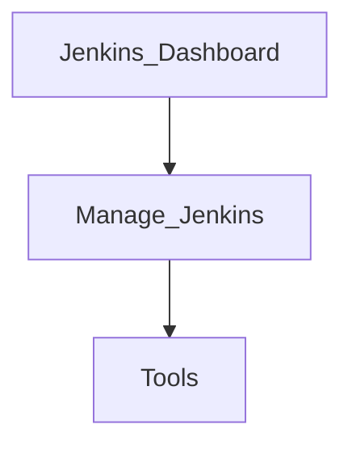

# Global Tool configuration

#### Jenkins Dashboard

Navigate to the following path: 

#### JDK Installations

1. Click on the **"Add JDK"** button.
2. Set the following:
   - **Name**: `JDK17`
   - **JAVA_HOME**: `C:\Program Files\Microsoft\jdk-17.0.13.11-hotspot`

#### Git

- Accept the default settings.

#### Maven Installations

1. Click on **"Add Maven"**.
2. Click to **uncheck** the "Install automatically" option.
3. Set the following:
   - **MAVEN_HOME**: `C:\apache-maven-3.9.9`

#### Save

- Click the **Save** button.

